<div align="center">

<p>
  
  
</p>

### An AI-assisted workspace for learning

Didactio turns an idea into a structured teaching plan. On the backend, it combines AI generation with research-oriented prompt chaining to create educationally sound learning content. On the frontend, it provides a user-friendly content creation process and a book-like reading experience designed for working on a computer.

<br />

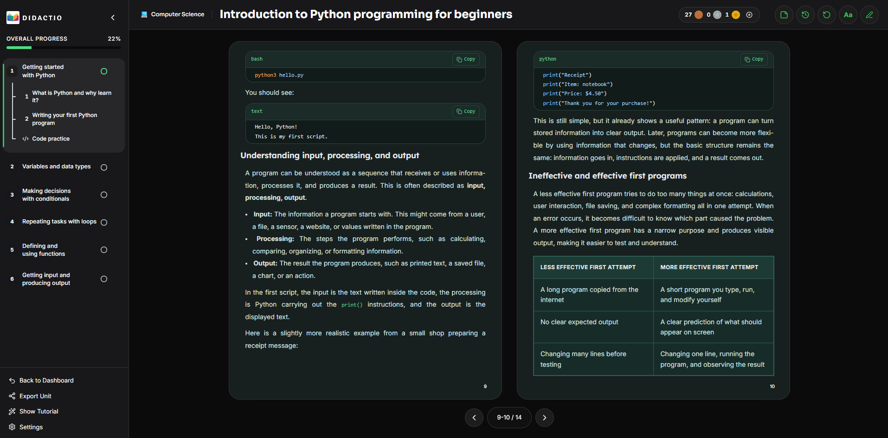

<br />

</div>

---

## The Idea

The idea comes from the frustration of working with traditional chatbots to learn about a new topic. If you have tried this before, you may have found that traditional chatbots often stay on the surface and rarely go deep into a subject, making learning and practice difficult unless you already have access to structured learning material.

Didactio was built to combine generative AI with guardrails based on educational theory, producing didactic units that are coherent, structured, and useful. Over time, it evolved into a broader learning suite with a user-friendly UI that keeps the learning process inside the Didactio platform.

---

## Showcase

### Library and Dashboard

The dashboard brings together units, folders, progress, creation actions, and fast access to content. The interface supports both light and dark modes.

<div align="center">
  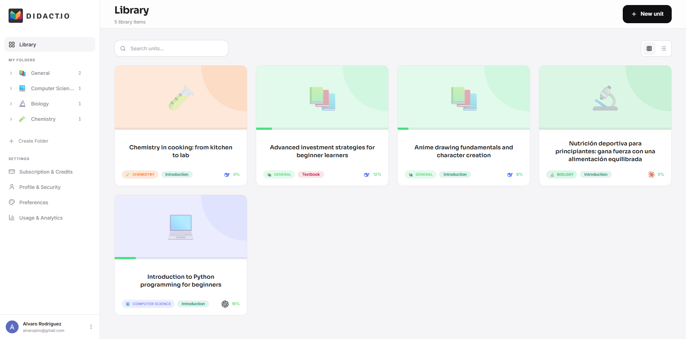
  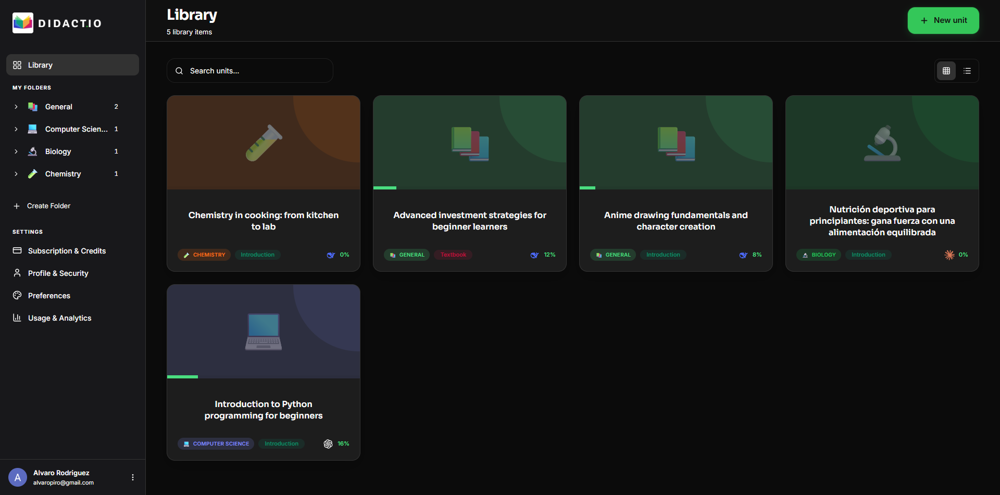
</div>

### Unit Viewer and Editor

The viewer/editor is the main workspace: reading, chapter navigation, rich editing, formatting tools, export views, and continuation of generated content.

<div align="center">
  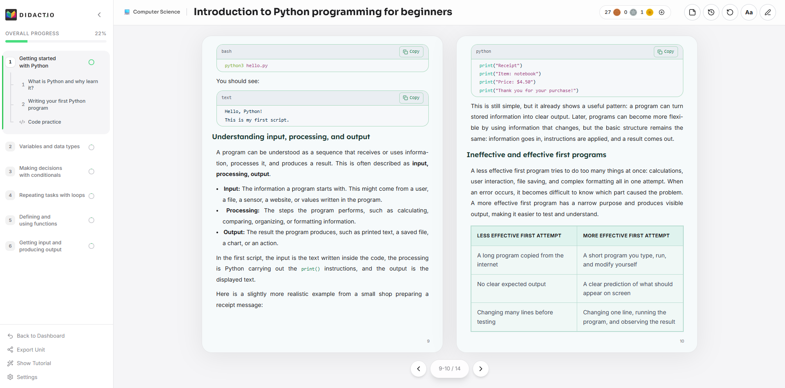
  
</div>

### Mobile Experience

Didactio also supports smaller screens with a mobile editor experience adapted for reading, reviewing, and essential actions.

<div align="center">
  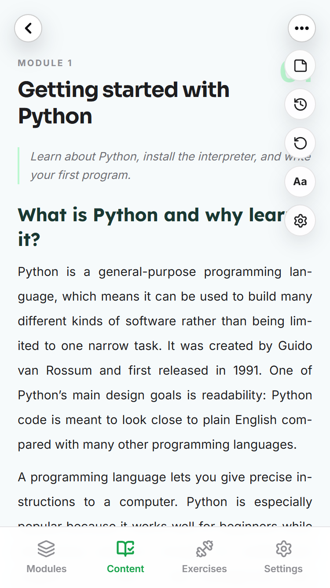
  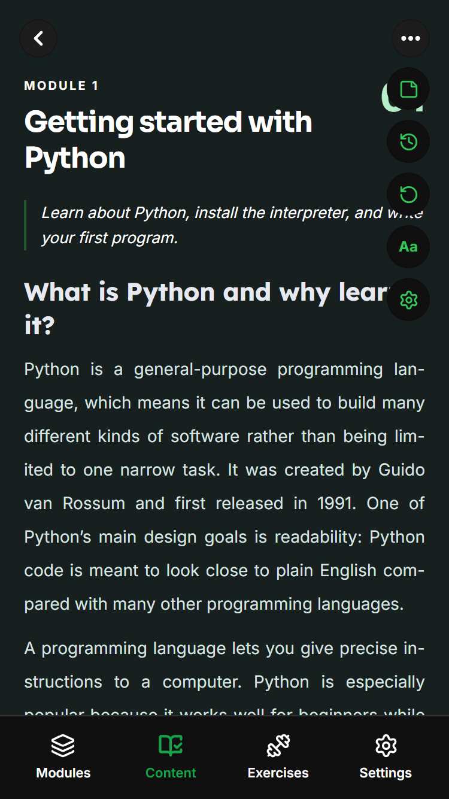
</div>

---

## Learning Activities

Didactio does not stop at the document. Each unit can be extended with learning activities that turn content into guided practice.

<table>
  <tr>
    <td width="50%">
      <h3>Quick check</h3>
      <p>Fast questions to verify immediate understanding and reveal gaps before moving forward.</p>
      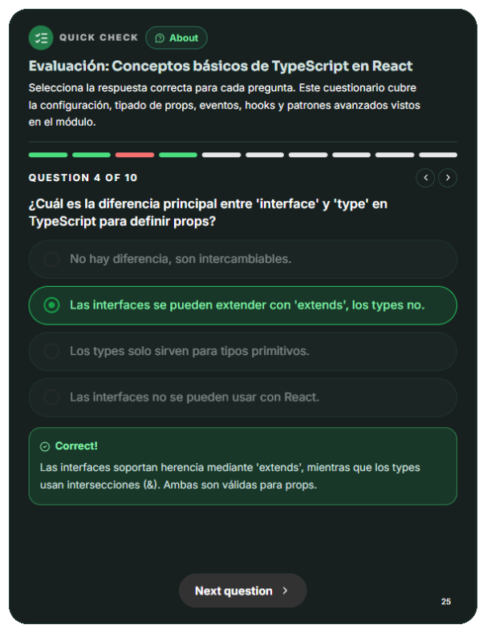
    </td>
    <td width="50%">
      <h3>Flash cards</h3>
      <p>Review cards for concepts, definitions, key terms, and active recall.</p>
      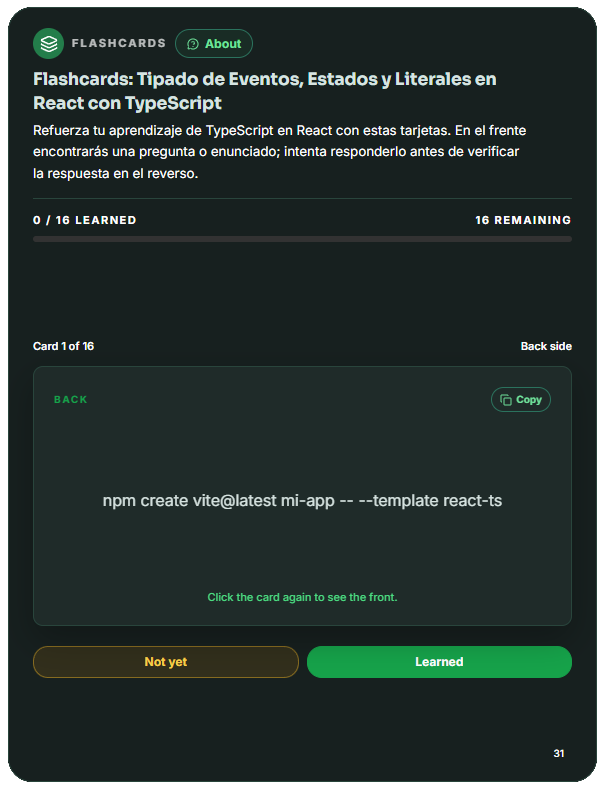
    </td>
  </tr>
  <tr>
    <td width="50%">
      <h3>Open response</h3>
      <p>Open-ended prompts for reasoning, justification, and deeper comprehension checks.</p>
      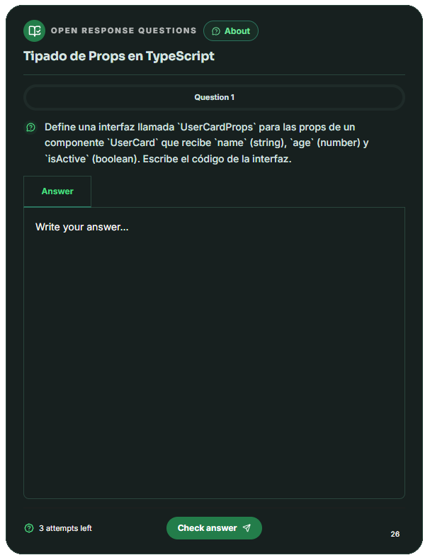
    </td>
    <td width="50%">
      <h3>Case study</h3>
      <p>Applied scenarios that connect theory with decisions, analysis, and classroom-friendly situations.</p>
      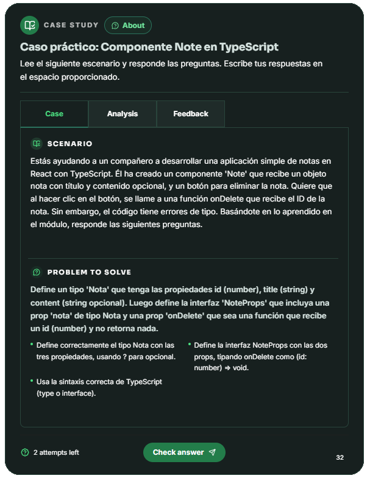
    </td>
  </tr>
  <tr>
    <td width="50%">
      <h3>Code practice</h3>
      <p>Coding exercises for technical subjects, with prompts designed for step-by-step practice.</p>
      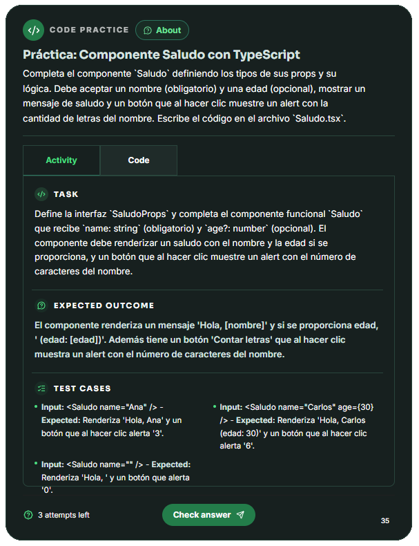
    </td>
    <td width="50%">
      <h3>Mini project</h3>
      <p>Larger challenges that synthesize content into a practical, assessable deliverable.</p>
      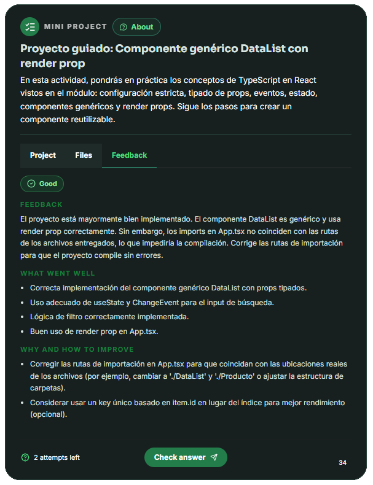
    </td>
  </tr>
</table>

---

## Authentication and Security

Authentication is owned by the backend. Users create and access accounts via Google OAuth. The server creates the session, persists refresh-token state, and issues a short-lived access token for authenticated API calls. The durable part of the session stays in an HTTP cookie, while the access token is intentionally temporary, so the frontend can make lightweight requests without becoming the source of truth for identity.

Protected feature routes resolve the current user before reaching domain logic such as units, notes, folders, credits, or billing. Admin-only behavior is separated from regular user routes.

The same boundary exists for generated content. AI output and editor input eventually become HTML rendered back to the user, so the backend treats that content as data that must be normalized, hashed, extracted, and sanitized before reuse. Authentication, API validation, and content safety therefore work as one request pipeline instead of as isolated checks.

---

## Viewer and Editor Engine

The unit viewer/editor is the core production surface of Didactio. It combines a readable chapter experience with a rich editing environment built on Tiptap and ProseMirror. Behind the interface, the app handles HTML normalization, paste cleanup, heading identifiers, code highlighting, chapter rendering, reading progress, export views, and continuity between generated sections.

This is where Didactio behaves less like a chat wrapper and more like an authoring tool: content can be generated, inspected, edited, styled, exported, and revisited as part of a durable didactic unit.

<div align="center">
  
  
</div>

---

## Exporting Content and Exercises

Users can export didactic unit content after editing it, and they can also export the generated learning activities attached to the unit. That matters because the material is not locked inside the app: chapters, explanations, and exercises can move into the formats teachers actually use for delivery, review, or classroom preparation.


<div align="center">
  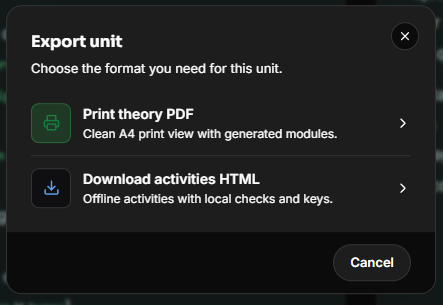
</div>

---

## AI, Preferences, and Personalization

The AI layer is configurable around the way each user wants to work. Didactio supports model selection, authoring language, tone, learner level, extra instructions, and cost-aware generation paths. The backend separates prompt building, schemas, providers, streaming, telemetry, and generation run state so long-running content creation remains observable and recoverable.

User preferences are not decorative settings. They shape how content is created, how the interface behaves, and how the product adapts to different teaching styles.

<div align="center">
  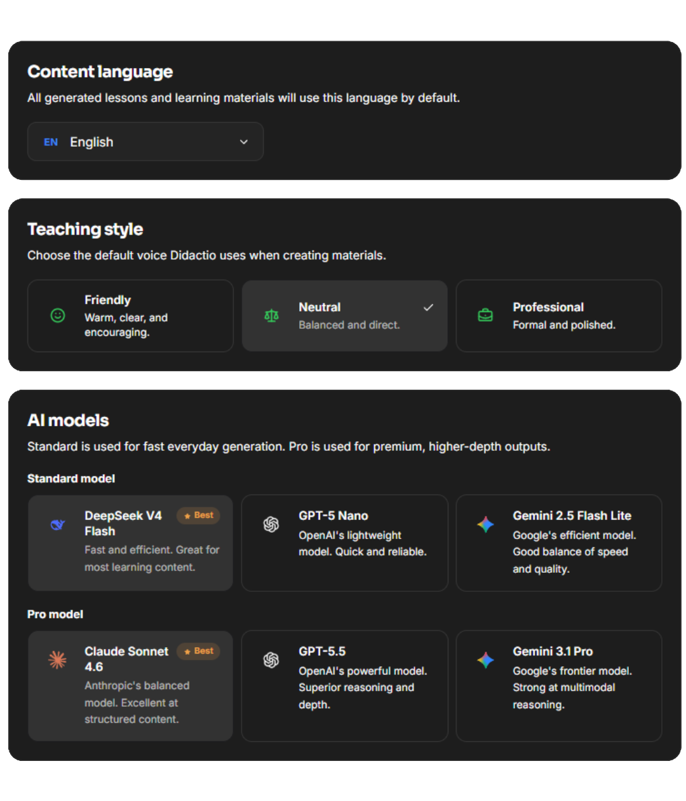
</div>

---

## Notes, History, Styles, and Guidance

Didactio adds supporting tools around the editor so a unit can evolve over time. Notes let users keep contextual annotations close to the material. Version history gives visibility into changes. Presentation styles make the same content feel different depending on the teaching context. The tutorial helps new users understand the workflow without leaving the product.

<table>
  <tr>
    <td width="50%">
      <h3>Notes</h3>
      <p>Contextual annotations attached to the working unit.</p>
      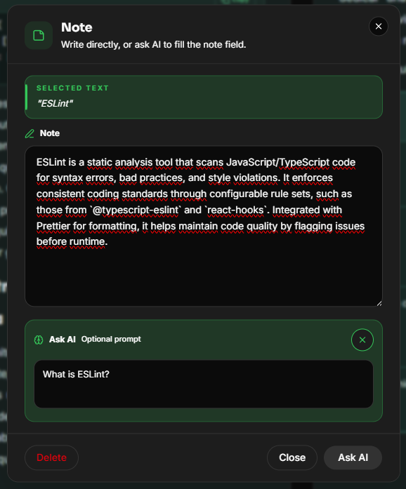
    </td>
    <td width="50%">
      <h3>Version history</h3>
      <p>A timeline for tracking how generated and edited material changes.</p>
      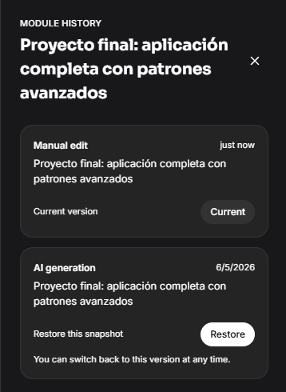
    </td>
  </tr>
  <tr>
    <td width="50%">
      <h3>Tutorial</h3>
      <p>In-product guidance for understanding the workspace and creation flow.</p>
      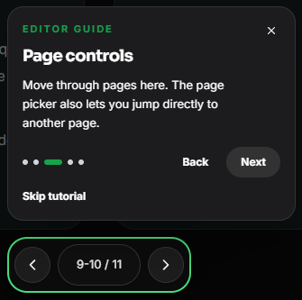
    </td>
    <td width="50%">
      <h3>Analytics</h3>
      <p>Usage insights for understanding activity, credits, and product behavior.</p>
      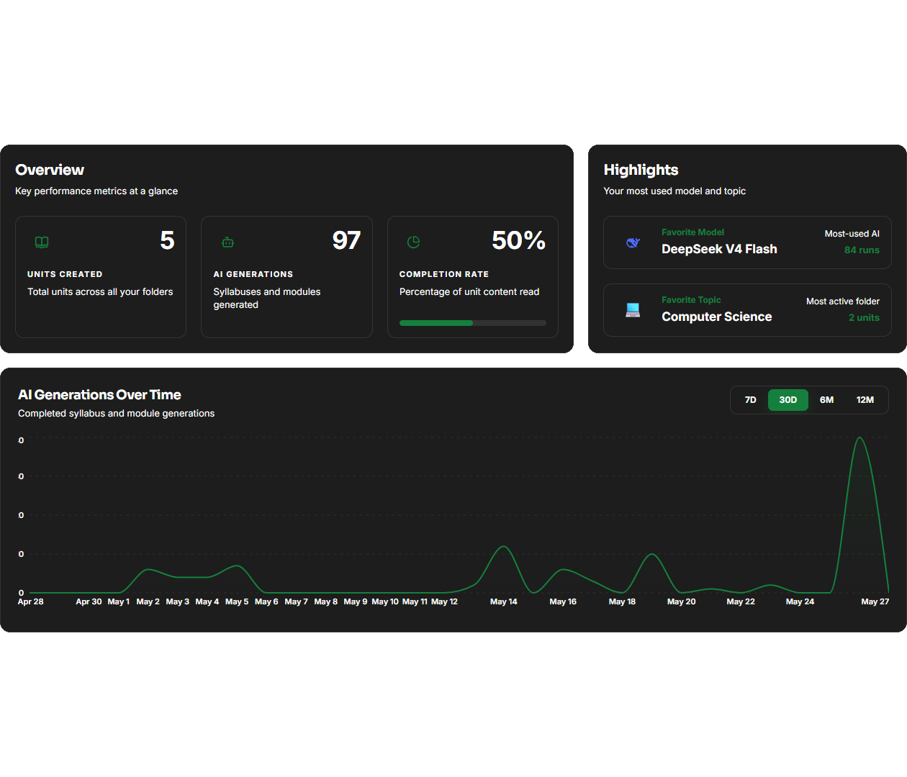
    </td>
  </tr>
</table>

### Presentation Styles

The same unit can be displayed through different visual treatments, making the authoring experience adaptable to different materials and audiences.

<div align="center">
  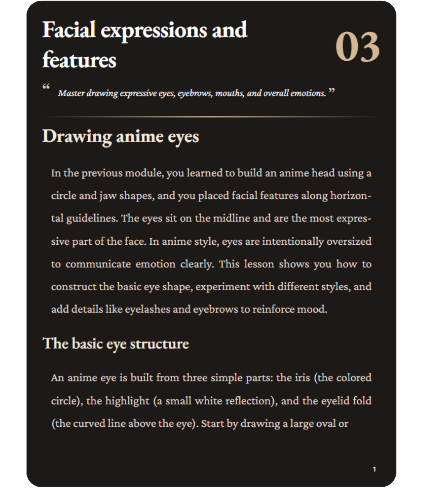
  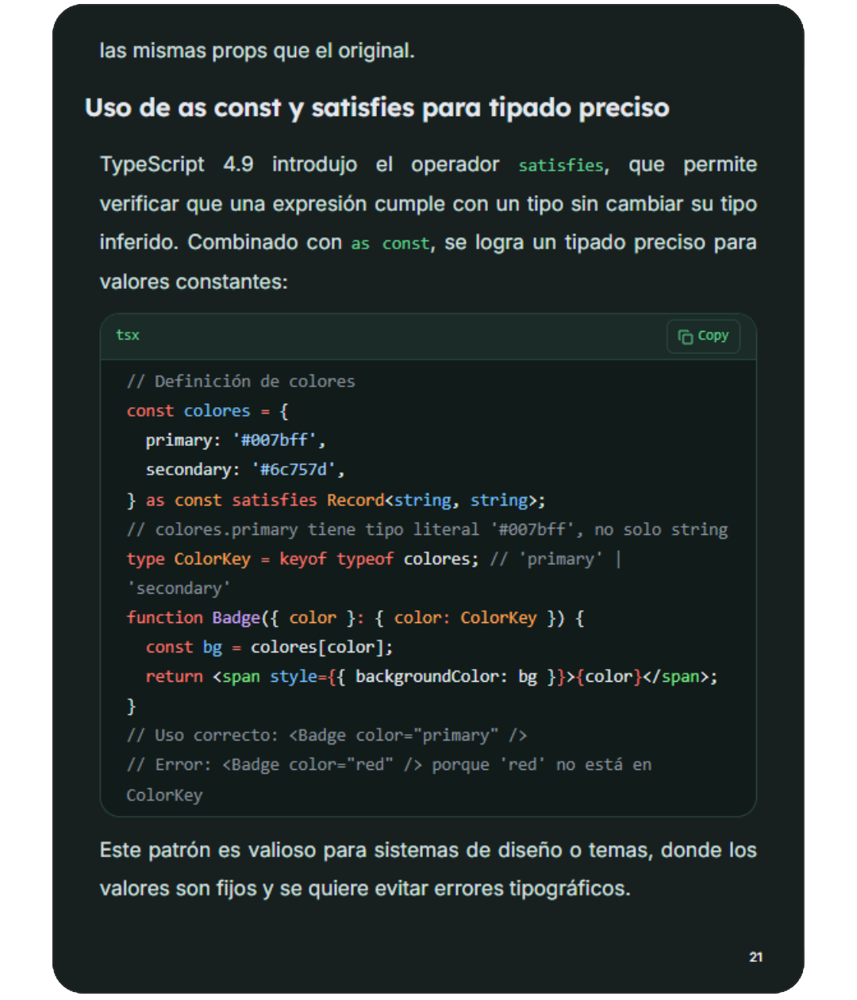
  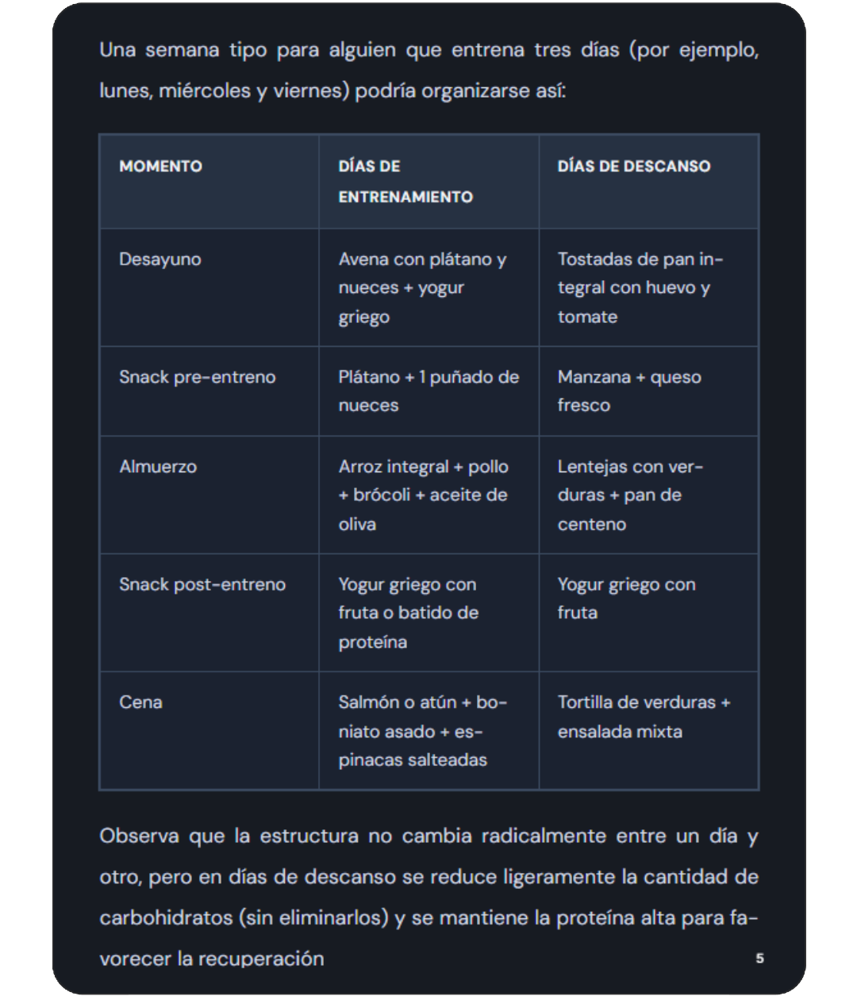
</div>

---

## Credits and Plans

Didactio includes a credit-based generation model. Credits make AI usage explicit, measurable, and easier to connect to pricing. The backend tracks generation costs and reservations, while the product layer connects plans, Stripe billing, account state, and available balance.

<div align="center">
  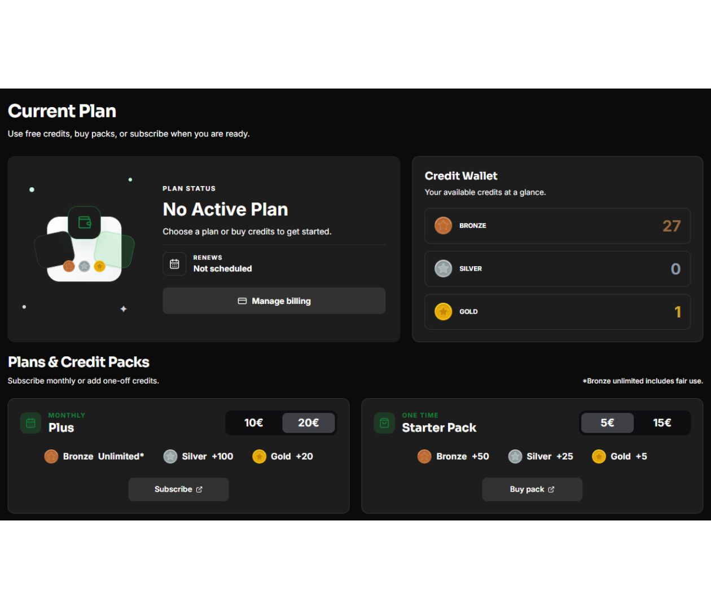
</div>

---

## Architecture

```txt
didactio/
|-- backend/
|   |-- src/
|   |   |-- ai/                  # Model catalog, prompt builders, schemas, streaming, and telemetry
|   |   |-- analytics/           # Usage analytics and reporting routes
|   |   |-- auth/                # Core auth, Google OAuth, cookies, sessions, users, and admin routes
|   |   |-- billing/             # Stripe pricing, checkout, webhooks, and billing event storage
|   |   |-- commands/            # Operational scripts for onboarding resets and template exports
|   |   |-- config/              # Environment parsing and runtime configuration
|   |   |-- credits/             # Generation costs, reservations, and credit accounting
|   |   |-- didactic-unit/       # Units, planning, chapters, notes, progress, templates, and HTTP routes
|   |   |-- folders/             # Folder defaults, persistence, and organization routes
|   |   |-- generation-runs/     # Long-running generation state and persistence
|   |   |-- html/                # Sanitization, hashing, continuity, and content block extraction
|   |   |-- http/                # API helpers, route dependencies, auth helpers, and health checks
|   |   |-- learning-activities/ # Activity models, stores, and routes
|   |   |-- logging/             # Application logger
|   |   |-- mongo/               # MongoDB connection lifecycle
|   |   |-- presentation-theme/  # Presentation theme types and validation
|   |   |-- providers/           # Syllabus and chapter generation providers
|   |   |-- utils/               # Shared backend utilities
|   |   |-- app.ts               # Express application assembly
|   |   `-- server.ts            # Runtime entrypoint
|   `-- tests/
|
|-- frontend/
|   |-- assets/                  # Static frontend assets
|   |-- src/
|   |   |-- components/          # UI, dashboard, marketing, auth, and onboarding
|   |   |-- dashboard/           # API client, editor, export, hooks, and utilities
|   |   |-- pages/               # Home, login, pricing, dashboard, onboarding
|   |   `-- theme/               # Light/dark appearance
|   `-- tests/
|
`-- package.json                 # npm workspace for frontend and backend
```

---

## Technical Stack

| Layer | Technologies |
| --- | --- |
| Frontend | React 19, Vite 7, TypeScript, Tailwind CSS 4, Radix UI, lucide-react, Motion |
| Editor | Tiptap 3, ProseMirror, lowlight, Shiki, unified/remark/rehype |
| Backend | Node.js, Express 5, TypeScript, MongoDB, Passport, JWT, Zod |
| AI | AI SDK, configurable providers, NDJSON streaming, generation telemetry |
| Payments | Stripe |
| Quality | Vitest, Testing Library, ESLint, V8 coverage |

---

## Local Setup

### 1. Install dependencies

```bash
npm install
```

### 2. Configure the backend

```bash
cp backend/.env.example backend/.env
```

Edit `backend/.env` with your real MongoDB, authentication, AI provider, and Stripe values if you want to test payments.

### 3. Start the services

In one terminal:

```bash
npm run dev:backend
```

In another terminal:

```bash
npm run dev:frontend
```

Defaults:

- Frontend: `http://localhost:5173`
- Backend: `http://localhost:3000`

---

## Useful Scripts

| Command | Description |
| --- | --- |
| `npm run dev:frontend` | Starts the Vite frontend. |
| `npm run dev:backend` | Starts the backend with `tsx watch`. |
| `npm run build` | Builds all workspaces. |
| `npm run test` | Runs frontend and backend tests. |
| `npm run test:coverage` | Runs tests with coverage. |
| `npm run lint` | Runs ESLint where available. |

---

## Project Status and Author

Didactio is a private educational project in active development, designed and developed by **Alvaro Rodriguez Pizarro**. This repository works as a product foundation, technical showcase, and demonstration of a complete generative education experience.

The source code is made available here only for authorized review. Check the license before using any part of the project.

---

## License

This project uses a proprietary license. All rights are reserved. No permission is granted to copy, modify, distribute, sublicense, host, resell, or use the code for commercial or public purposes without express written authorization.

See [LICENSE](LICENSE) for details.
